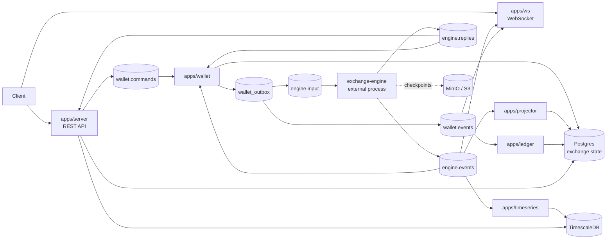
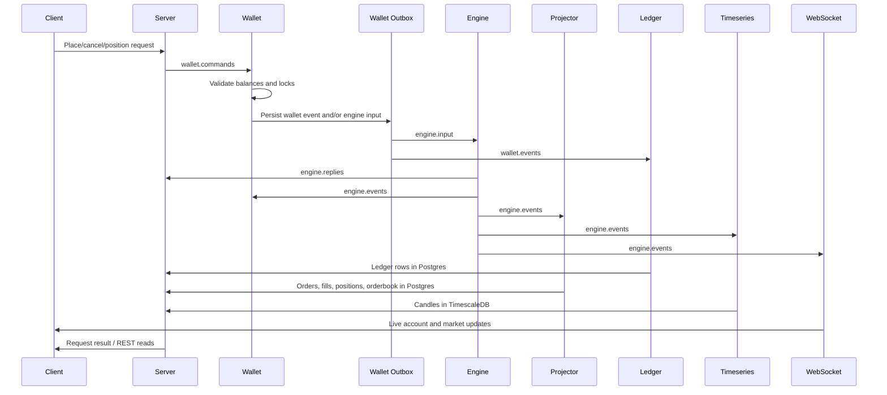

# Perpex Exchange

Rust services for the exchange side of Perpex: HTTP API, wallet reservation and
accounting, stream consumers, read models, timeseries writes, and websocket
fanout.

The matching engine is a separate repo and process. Exchange publishes validated
inputs to `engine.input` and consumes `engine.replies` plus `engine.events`; it
does not start, stop, or probe the engine.

## Architecture



## Request Flow



## Repo Layout

```text
apps/server       HTTP API and request/reply coordination
apps/wallet       Balance checks, locks, wallet events, engine input outbox
apps/projector    Engine event projections into Postgres read models
apps/ledger       Accounting journal from wallet.events
apps/timeseries   Trades and candles in TimescaleDB
apps/ws           Live websocket fanout from wallet.events and engine.events
crates/config     Shared env/config helpers
crates/db         Database access and migrations
crates/protocol   Rust stream protocol types
tools/e2e-smoke   End-to-end smoke driver
tools/engine-ingress
                  Manual mark/funding input publisher
test-harness      Manual infra and e2e test scripts
docs              Protocol notes and service-specific details
```

## Getting Started

Prerequisites:

- Rust stable
- Docker with Compose
- `sqlx-cli` for migrations in the harness

Install SQLx CLI:

```sh
cargo install sqlx-cli --version 0.9.0 --no-default-features --features rustls,postgres
```

Use sibling repo checkouts:

```sh
mkdir -p ~/perpex
cd ~/perpex
git clone git@github.com:whoisasx/exchange-server.git exchange
git clone git@github.com:whoisasx/exchange-engine.git engine
```

## Run The Full E2E Test

From this repo:

```sh
test-harness/infra.sh up
```

In another terminal, start the engine:

```sh
cd ../engine
test-harness/run-exchange-e2e-engine.sh
```

Then run the exchange smoke:

```sh
cd ../exchange
test-harness/smoke.sh
```

Expected success:

```text
e2e smoke passed
e2e smoke complete
```

Cleanup:

```sh
cd ../exchange
test-harness/infra.sh down
```

Stop the engine with `Ctrl-C`.

## Useful Commands

```sh
cargo fmt --all -- --check
cargo test --workspace
test-harness/infra.sh status
test-harness/infra.sh logs
```

## Configuration

Start from `.env.example` for local service runs. The main connection points are:

- `DATABASE_URL`: Postgres exchange state
- `TIMESERIES_DATABASE_URL`: TimescaleDB candles/trades
- `REDPANDA_BROKERS`: Redpanda brokers
- `S3_*`: MinIO/S3 checkpoint settings used by tests and engine-adjacent flows
- `JWT_SECRET`, `SERVER_*`, `WS_*`: API and websocket settings

## More Detail

- [Test harness](test-harness/README.md)
- [Engine stream contract](docs/engine-contract.md)
- [Wallet events](docs/wallet-events.md)
- [Timeseries](docs/timeseries.md)
- [WebSocket](docs/websocket.md)
- [Ledger](docs/ledger.md)
- [Orderbook](docs/orderbook.md)
