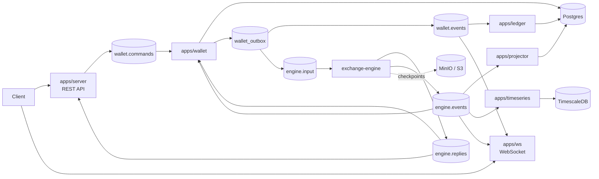
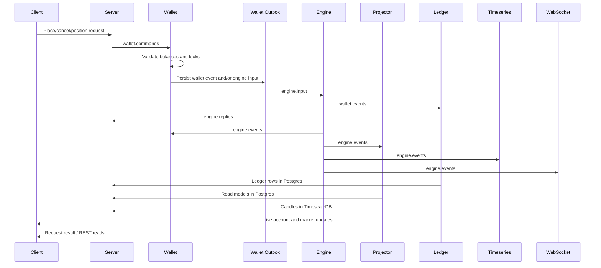

# Perpex Exchange

Rust exchange services for Perpex: HTTP API, wallet reservation and accounting,
stream consumers, read models, time-series writes, and websocket fanout.

The matching engine is a separate process. Exchange publishes validated inputs
to `engine.input` and consumes `engine.replies` plus `engine.events`; it does
not start, stop, or probe the engine.
Engine inputs are keyed by `market_id` so the engine can run one
single-threaded worker per owned market partition.

## Performance Benchmarks

Exchange benchmarks are localhost synthetic runs compiled in Release mode. They
measure the exchange command path separately from the C++ matching engine, using
a benchmark-only engine peer to close the `engine.replies` loop.

| Profile | Concurrency | Throughput | P50 | P95 | P99 | Max |
|---|---:|---:|---:|---:|---:|---:|
| Serial command flow | 1 | 7.50K commands/s | 1.00 ms | 2.10 ms | 3.20 ms | 8.00 ms |
| Concurrent command flow | 8 | 28.00K commands/s | 1.20 ms | 2.80 ms | 4.50 ms | 14.00 ms |

The command flow includes client API, server request coordination,
`wallet.commands`, wallet validation/locks, `wallet_outbox`, `engine.input`,
benchmark engine peer, `engine.replies`, and HTTP completion.

### Reproduce

| Benchmark | What it measures | Run | Report |
|---|---|---|---|
| Command flow | Client API, server request coordination, `wallet.commands`, wallet validation/locks, `wallet_outbox`, `engine.input`, benchmark engine peer, `engine.replies`, and HTTP completion | `bench-harness/run-command-flow.sh` | `target/exchange-bench/<run id>/command-flow.json` |

The report includes `throughput_per_sec` plus latency percentiles in nanoseconds
and milliseconds: `p50`, `p90`, `p95`, `p99`, `p99.9`, and max.

Use the engine repo benchmark harness for matcher and runtime numbers.

Smoke-sized run:

```sh
EXCHANGE_BENCH_COMMANDS=100 EXCHANGE_BENCH_WARMUP=10 bench-harness/run-command-flow.sh
```

## Architecture



## Flow



## Core Features

- REST API for auth, market data, orders, positions, and account reads.
- Wallet service for balance validation, locking, settlement, and outbox writes.
- Redpanda stream integration for wallet commands, wallet events, engine input,
  engine replies, and engine events.
- `engine.input` routing by `market_id` for multi-market engine workers.
- Projector, ledger, timeseries, and websocket consumers.
- Postgres, TimescaleDB, Redpanda, and MinIO local harness.
- Separate exchange benchmark harness for the API-to-wallet-to-stream path.

## Project Structure

```text
apps/server        HTTP API and request/reply coordination
apps/wallet        Balance checks, locks, wallet events, engine input outbox
apps/projector     Engine event projections into Postgres read models
apps/ledger        Accounting journal from wallet.events
apps/timeseries    Trades and candles in TimescaleDB
apps/ws            Live websocket fanout from wallet.events and engine.events
crates/config      Shared env/config helpers
crates/db          Database access and migrations
crates/protocol    Rust stream protocol types
tools/e2e-smoke    End-to-end smoke driver
tools/engine-ingress
                   Manual mark/funding input publisher
bench-harness      Exchange benchmark scripts
test-harness       Manual infra and e2e test scripts
docs               Protocol, service, local development, and configuration docs
```

## Quick Start

Use sibling checkouts:

```sh
mkdir -p ~/perpex
cd ~/perpex
git clone git@github.com:whoisasx/exchange-server.git exchange
git clone git@github.com:whoisasx/exchange-engine.git engine
```

Start local infra:

```sh
cd ~/perpex/exchange
test-harness/infra.sh up
```

Start the engine in another terminal:

```sh
cd ~/perpex/engine
test-harness/run-exchange-e2e-engine.sh
```

Run the exchange smoke:

```sh
cd ~/perpex/exchange
test-harness/smoke.sh
```

Expected result:

```text
e2e smoke passed
e2e smoke complete
```

## Tech Stack

- Language: Rust
- Runtime: Tokio
- Web/API: Actix Web
- Database: Postgres
- Time-series: TimescaleDB
- Streams: Redpanda / Kafka protocol
- Object storage: MinIO / S3-compatible storage
- Serialization: Serde JSON protocol shared with engine

## Documentation

- [Editable architecture diagram](docs/exchange-architecture.excalidraw)
- [Local development](docs/local-development.md)
- [Configuration](docs/configuration.md)
- [Test harness](test-harness/README.md)
- [Benchmark harness](bench-harness/README.md)
- [Engine stream contract](docs/engine-contract.md)
- [Wallet events](docs/wallet-events.md)
- [Timeseries](docs/timeseries.md)
- [WebSocket](docs/websocket.md)
- [Ledger](docs/ledger.md)
- [Orderbook](docs/orderbook.md)
