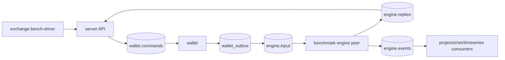
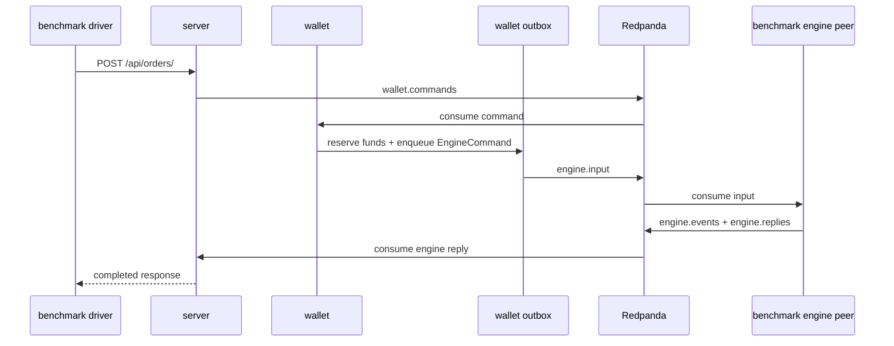

# Exchange Benchmark Harness

This harness measures the exchange command path separately from the C++ engine
benchmark harness. It keeps the runtime protocol as JSON and uses the same four
infra containers as the e2e test harness: Postgres, Redpanda, TimescaleDB, and
MinIO.



## Quick Run

From the exchange repo:

```sh
bench-harness/run-command-flow.sh
```

The script starts/prepares infra, builds services and benchmark binaries, starts
exchange services, starts the benchmark-only engine peer, then writes results to
`target/exchange-bench/<run id>/`.

The default profile is `release`. Use `EXCHANGE_BENCH_PROFILE=debug` only for a
faster local smoke build.

Use a smaller smoke-sized run:

```sh
EXCHANGE_BENCH_COMMANDS=100 \
EXCHANGE_BENCH_WARMUP=10 \
bench-harness/run-command-flow.sh
```

Increase client concurrency:

```sh
EXCHANGE_BENCH_COMMANDS=10000 \
EXCHANGE_BENCH_WARMUP=1000 \
EXCHANGE_BENCH_CONCURRENCY=8 \
bench-harness/run-command-flow.sh
```

If infra is already up and prepared:

```sh
EXCHANGE_BENCH_SKIP_INFRA_UP=1 bench-harness/run-command-flow.sh
```

Stop the benchmark infra when you are done:

```sh
test-harness/infra.sh down
```

## What Is Timed

The report times only completed order commands after setup. Signup, initial
deposit, service startup, migrations, and market seeding are excluded.



## Output

`command-flow.json` contains:

- `throughput_per_sec`
- `latency_ns.p50`, `p90`, `p95`, `p99`, `p999`, `max`
- `latency_ms.p50`, `p90`, `p95`, `p99`, `p999`, `max`
- command count, warmup count, and concurrency

The benchmark-only engine peer is intentionally small. It exists only to make
the exchange repo measure its own API, wallet, outbox, Redpanda, reply, and
consumer path without requiring the real engine repo process.
