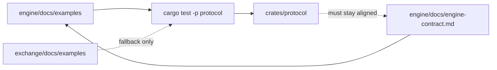

# Engine Examples

The authoritative engine protocol examples live in
`../../../engine/docs/examples` in the combined workspace.

The JSON files in this directory are fallback fixtures for standalone exchange
test runs and should stay aligned with the engine examples. In this combined
workspace, `cargo test -p protocol` reads `../../../engine/docs/examples` first
and falls back to this directory only when the sibling engine checkout is
unavailable.

