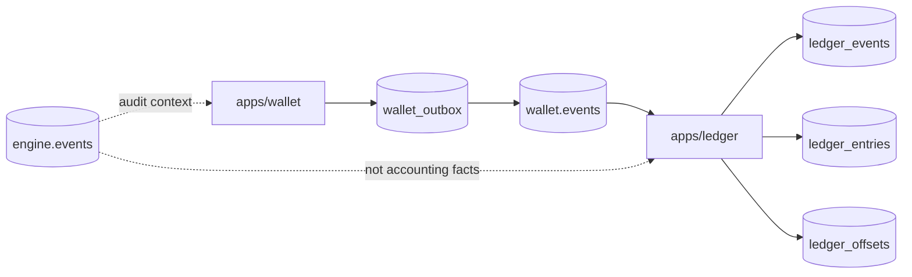

# Ledger Service

`apps/ledger` consumes `wallet.events` and writes an immutable accounting
trail. Wallet events are the source of balance mutations.



Run:

```sh
cargo run -p ledger
```

The wallet remains the hot-path balance owner. It owns deposits, withdrawals,
balances, locked funds, and reservations. When engine events move money, wallet
applies the resulting account deltas, releases, fees, funding payments, and
liquidation or ADL settlements, then enqueues wallet events in `wallet_outbox`.
The wallet outbox relay publishes those events to `wallet.events` for ledger to
record.

Engine events are audit context only for ledger. They may be referenced from
wallet events, but they are not accounting facts on their own. Wallet and engine
replies are request lifecycle messages and must not create ledger entries.

Ledger v1 does not replace wallet writes; it mirrors wallet events into:

- `ledger_events`: one journal row per consumed stream record.
- `ledger_entries`: normalized balance deltas derived from each event.
- `ledger_offsets`: consumed Redpanda offsets.

For outbox-backed wallet events, `ledger_events.logical_event_id` stores the
event payload `event_id` and has a unique index. Replayed publishes of the same
logical wallet event are skipped while the ledger offset still advances.

The full wallet event schema is in `docs/wallet-events.md`.

Entry mapping:

| Wallet event | Ledger entries |
| --- | --- |
| `DepositApplied` | `DEPOSIT`: `total_delta=+amount`, `locked_delta=0` |
| `WithdrawalApplied` | `WITHDRAWAL`: `total_delta=-amount`, `locked_delta=0` |
| `FundsReserved` | `RESERVE`: `total_delta=0`, `locked_delta=+amount` |
| `FundsReleased` | `RELEASE`: `total_delta=0`, `locked_delta=-amount` |
| `TradeSettled` | `TRADE_DEBIT`: `total_delta=-debit_amount`, `locked_delta=-debit_amount`; `TRADE_CREDIT`: `total_delta=+credit_amount`, `locked_delta=0` |
| `AccountDeltaApplied` | `<kind>`: `total_delta=total_delta`, `locked_delta=locked_delta` |

Ledger starts from stored offsets, or earliest offsets when no offset is stored.
