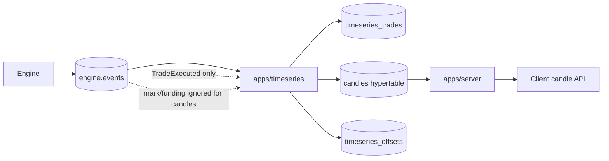

# Timeseries Service

`apps/timeseries` consumes `engine.events` and writes trade history and market candles.



Run:

```sh
cargo run -p timeseries
```

Storage:

- `TIMESERIES_DATABASE_URL` is required. It must point at a TimescaleDB database.
- The timeseries service writes trade history, candles, and consumer offsets only through `TIMESERIES_DATABASE_URL`.
- The REST server initializes a separate timeseries pool from `TIMESERIES_DATABASE_URL` for candle reads. All non-timeseries state continues to use `DATABASE_URL`.
- The dedicated timeseries migration bundle enables the `timescaledb` extension and creates `candles` as a hypertable. Startup fails if TimescaleDB is unavailable.
- `crates/db/migrations/0007_timeseries.sql` is retained unchanged for existing main database migration history. New runtime paths should not depend on the main Postgres timeseries tables.

Source events:

- `TradeExecuted` is the source for trades and candles.
- Liquidation executions are still trades and carry `execution_reason`.
- `MarkPriceUpdated`, funding rate, and funding settlement events may be mirrored into history tables later, but they do not create or update candles.

For every `TradeExecuted`, the service writes:

- `timeseries_trades`: one idempotency row keyed by `(market_id, engine_sequence)`.
- `candles`: OHLCV rows for `1m`, `5m`, `15m`, `1h`, and `1d`.
- `timeseries_offsets`: consumed Redpanda offsets.

`engine_sequence` is per-market. Use `(market_id, engine_sequence)` for market ordering and idempotency; global ordering across markets is not guaranteed. Use `engine_timestamp_ms` to choose the candle bucket.

Read candles through the REST server:

```text
GET /api/markets/{market_id}/candles?interval=1m&start_ms=1710000000000&end_ms=1710003600000&limit=500
```

Supported intervals are `1m`, `5m`, `15m`, `1h`, and `1d`. The response is sorted oldest to newest after selecting the latest matching rows up to `limit`.
